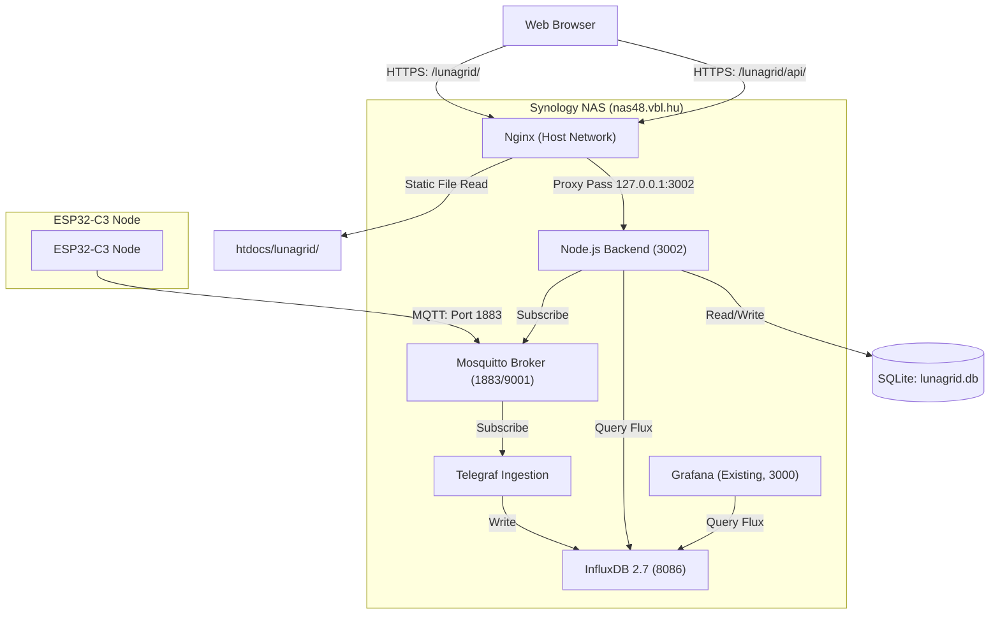

# Lunagrid Synology NAS Deployment Plan

This document outlines the strategy and execution steps for deploying the Lunagrid monitoring stack into the Synology NAS environment (`nas48.vbl.hu`). 

> [!NOTE]
> All repository-level configuration changes (Docker Compose service definitions, Telegraf config, Nginx proxy routes, and ESP32 firmware MQTT target updates) have already been implemented in the codebase. This document serves as the guide for actual deployment execution, validation, and maintenance.

---

## 1. Target Architecture Overview

The deployment integrates with the existing NAS network services (Nginx, Grafana) to keep resource consumption minimal.



---

## 2. Implemented Configurations

The following configurations are committed to the codebase and ready for deployment:

1. **Docker Compose**: The new services (`lunagrid-mosquitto`, `influxdb`, `lunagrid-telegraf`, and `lunagrid-backend`) have been appended to [docker-compose.yml](../../infra/nodes/nas48/docker-compose.yml#L107).
2. **Telegraf Config**: Built at [telegraf.conf](../../infra/nodes/nas48/etc/lunagrid/telegraf.conf) using `tcp://lunagrid-mosquitto:1883`.
3. **Nginx Reverse Proxy**: Configured in [nginx.conf](../../infra/nodes/nas48/etc/nginx/nginx.conf#L114-L139) to route `/lunagrid/` to the static directory and `/lunagrid/api/` to `127.0.0.1:3002`.
4. **Firmware Target**: Updated `mqtt_server` in [main.cpp](../firmware/src/main.cpp#L10) to point to `mqtt.nas48.vbl.hu`.

---

## 3. Step-by-Step Deployment Execution

Follow these steps directly on the Synology NAS and your local machine to deploy the system.

### Step 1: Prepare Host Storage Directories & Permissions (on NAS)
Because Docker containers run under specific unprivileged UIDs, run these commands in the NAS shell to set up storage paths and permissions:

```bash
# 1. Create the persistent storage folders
sudo mkdir -p /volume1/storage/lunagrid/mosquitto/data
sudo mkdir -p /volume1/storage/lunagrid/mosquitto/log
sudo mkdir -p /volume1/storage/lunagrid/influxdb
sudo mkdir -p /volume1/storage/lunagrid/backend

# 2. Set ownership for unprivileged container user IDs
sudo chown -R 1883:1883 /volume1/storage/lunagrid/mosquitto
sudo chown -R 1000:1000 /volume1/storage/lunagrid/influxdb

# 3. Set read/write permissions for the backend database folder
sudo chmod -R 775 /volume1/storage/lunagrid/backend
```

### Step 2: Deploy Nginx Static Frontend (from local machine)
Run the automated deployment script from your local workspace to compile and upload the frontend static assets to the NAS over SSH:

```bash
# Execute local deploy script
/home/bvarnai/workspace/lunagrid/tools/deploy.sh
```

> [!TIP]
> The [deploy.sh](../tools/deploy.sh) script automatically runs `npm run build` locally and uploads the compiled code via `rsync` to `bvarnai@nas48`.

### Step 3: Launch Docker Services (on NAS)
Pull changes from the repository on the NAS, build the Node.js backend image, and start the containers:

```bash
# Go to node directory on the NAS
cd ~/infra/nodes/nas48

# Stop the currently running container stack
docker-compose down

# Rebuild the backend image and start the stack
docker-compose up -d --build
```

---

## 4. Post-Deployment Verification

### 1. Web Application & API Check
- Navigate to `https://nas48.vbl.hu/lunagrid/` in your browser.
- Open the **Settings** tab and verify the API URL config points to `/lunagrid`.
- Confirm status page elements load and fetch API data correctly without CORS errors.

### 2. MQTT Communication Check
- Ensure your ESP32-C3 node is flashed and online.
- You can monitor MQTT broker messages from the NAS using:
  ```bash
  docker logs -f lunagrid-mosquitto
  ```

### 3. Grafana Dashboard Setup
- Log in to your existing Grafana interface (`https://nas48.vbl.hu/grafana/`).
- Go to **Connections > Data Sources > Add data source** and select **InfluxDB**.
- Configure it using:
  - **Query Language**: `Flux`
  - **URL**: `http://influxdb:8086`
  - **Organization**: `lunagrid-org`
  - **Token**: `lunagrid_secure_pass123`
  - **Default Bucket**: `lunagrid-telemetry`
- Click **Save & test** to verify.
- Import the pre-made dashboard from [lunagrid.json](../infrastructure/grafana/provisioning/dashboards/lunagrid.json).
